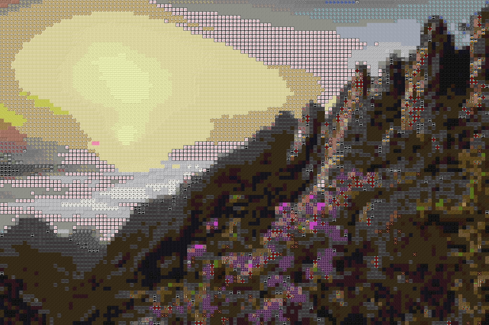

# Mosaico de imagens
> Gerador de imagens Incríveis

Usa uma imagem como base para criar outras colagens



## Instalação

Linux:
```sh
git clone https://github.com/Joao620/mosaico-de-imagens.git
cd mosaico-de-imagens
pip install -r requerimento.txt
make
```


## Exemplo de uso

em mosaico-de-imagens/python/
```sh
python main.py -b <imagem>
```

## Histórico de lançamentos


* 0.5
    * O esqueleto está funcionando

## Meta

João Carlos – [@João Carlos](https://www.linkedin.com/in/joão-carlos-a569a51b2) – jcarlos.paranhos@gmail.com

Distribuído sob a licença MIT. Veja `LICENSE` para mais informações.

[https://github.com/Joao620/mosaico-de-imagens](https://github.com/Joao620/mosaico-de-imagens)

